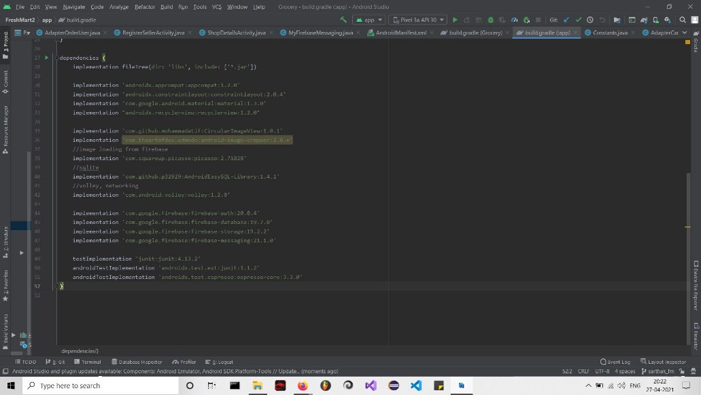
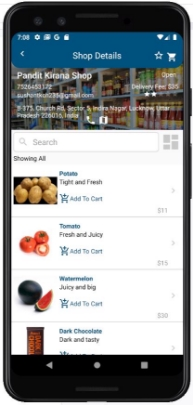
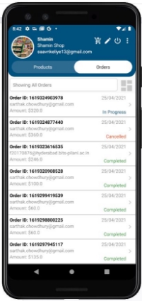
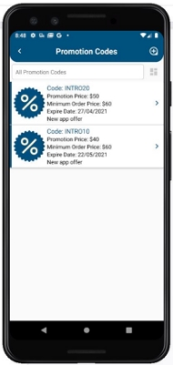
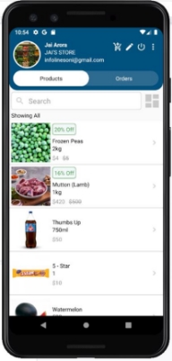

**BIRLA INSTITUTE OF TECHNOLOGY AND SCIENCE, PILANI**

**PROJECT REPORT ON**

**LiveMart**

**An Ecommerce Application MADE BY**

**GROUP 36**

|**NAME**|**ID**|
| - | - |
|JAI ARORA|2017B1A30876H|
|SHREYAS KHADSE|2017B3A31681H|
|SARTHAK CHOWDHURY|2017B5AA0909H|
|MUSKAN GUPTA|2017B1A30982H|
Prepared in complete fulfillment of CS F213

**Object-Oriented Programming**

**(March-April, 2021)**

[**Introduction and Acknowledgements](#_page2_x72.00_y72.00) **[3** ](#_page2_x72.00_y72.00)[About the Project](#_page3_x72.00_y72.00) [4** ](#_page3_x72.00_y72.00)[Languages and Frameworks Used](#_page4_x72.00_y72.00) [5** ](#_page4_x72.00_y72.00)[Product Feature](#_page5_x72.00_y460.78) [6** ](#_page5_x72.00_y460.78)[Unique Selling Point (U.S.P) of our App](#_page6_x72.00_y405.24) [7** ](#_page6_x72.00_y405.24)[Operating Environment](#_page7_x72.00_y72.00) [8** ](#_page7_x72.00_y72.00)[Dependencies Used](#_page7_x72.00_y289.58) [8** ](#_page7_x72.00_y289.58)[VIRTUAL TOUR of LiveMart](#_page8_x72.00_y72.00) [9 ](#_page8_x72.00_y72.00)User Dashboard pages 11 Conclusion 14**

**Introduction and Acknowledgements**

This project report is about the LiveMart Android application that we developed.

On the Merchant side, it has features like registration, signup, creating categories, sub-categories, items, and on the consumer side, it has features like browsing, purchasing, and a feedback system.

We'd like to express our gratitude to Mr. Subhrakanta Panda, the instructor in charge of the CS F213 (Object Oriented Programming) course, for providing us with this opportunity to work on an Ecommerce project. We'd like to express our gratitude to him for advising us on how to approach this project and what skill set to build, and we deeply appreciate it.

About the Project

**Project Purpose:**

LiveMart is an Android app that allows users to conduct regular buying and selling activities. In these difficult times for COVID, the app offers all of the features that a buyer or seller requires to buy/sell/track/review, and other orders with ease. We implemented all the modules that were given in the project description.

We worked as a team on various aspects of our project, including developing our various Android Activity Pages, Using API’s and writing the Backend Java Code for activity pages.

Languages and Frameworks Used

**For Frontend:**

\1. Android XML

**Backend and APIs used**:

1. Google Firebase as Database
1. Google Geocoding APIs for enabling GPS
1. Firebase Messaging Service

**Project Description:**

1. **Application Description-**This Android application is aimed to make customer and merchant experience smooth and user friendly so that a user with minimal knowledge can buy and sell products at ease and can access the various functionalities with no difficulties.
1. **Describing Languages and Frameworks Used**
1. **Android XML**- Android Extensible Markup Language was used to create the front end of the app and design UI layouts and the screen elements they contain, in the same way as we use it to  create web pages in HTML — with a series of nested elements and tags..
1. **JAVA**- Java was used to handle the backend functionality of the application, right from connecting activities to setting up adapters and models for showing up the relevant values in the UI. It is also used to establish connection with the database, send verification emails and integrate the app with the various APIs.
1. **Google FIrebase Database**- It is a cloud hosted NoSQL database in which we store the data and are able to synchronize it in real time with the users. We connect it to our android project with the SHA-1

key and then syncing our gradle with the corresponding .json file of the firebase project.

4. **Calendar API and Google Maps**- Calendar Api was Used to track events by Customers and Sellers concerning their orders. Google Maps was used to enable GPS features inside the App.
5. **Firebase Messaging Service**- This is the Firebase Cloud Messaging(FCM) service which is a reliable connection between our servers and the device and is used to send messages upstream from device or downstream from the servers using the FCM key and this has been used for the notification service in our app.
5. **GIT and GITHUB-** Version Control System for collaboration between different users. Helps Users to work together and share code files easily via commands like push, pull, commit, Pull.

Product Feature

1. GUI is clean and convenient to use and provides users with a hassle free experience that makes consumers’ lives more convenient.
1. Registration and Login for Users, Retailers, and Wholesalers using two step verification.
1. Forgot password option to recover password.
1. A customer can choose the shop he/she wants to shop from, filter the products according to the various categories or search the menu for what you want, add the product to their cart, apply any promotional codes if they have and place the order. They can check the status of the order with the other relevant details and rate the order when it is delivered. They also get a notification about the status update of their order.
5. A retailer can add products, choose discounts, add promotional codes for their shops and add pictures of their products too. They can set the maximum quantity available for each product and can also choose to be open or closed for service with the click of a button. They can update the order status and get a look at the feedback they receive. They also get a notification whenever a new order is received. They also have an option to switch to buy mode in which they can buy from the wholesalers available and at the same time enjoy all the features which the users do while buying.
5. Wholesalers can add products, choose discounts, add promotional codes for their shops and add pictures of their products just like the retailers. All of their features are same as retailers, just that they cannot buy from someone, they can only sell their products. They also get a notification whenever some retailer buys from them.

Unique Selling Point (U.S.P) of our App

Our Android Application will be beneficial for any Seller, Wholesaler or Retailer to take their store online. They can add products easily along with images, prices, discounts. The Retailer can switch between Purchase Mode to purchase from Wholesalers and Buy Mode to act as Seller enabling dual functionality.

.

Operating Environment

This application is android based. It will be able to run on all mobile phones which are based on Android. Users and the sellers just need to install the .apk file and register. The api used in this application are from google and the database is taken care of with firebase.

Dependencies Used

The dependencies used inside our application are listed below.

VIRTUAL TOUR of LiveMart

**1.Login and Signup pages**

2. **OTP Verification pages**

3. **User Dashboard Pages**

4. **Retailer Dashboard Pages**

5. **Wholesaler Dashboard Pages**

**CONCLUSION**

The aim of the Android application is to make online shopping more productive by linking buyers, retailers, and wholesalers through an eCommerce Android-based application where customers can buy goods

and retailers/wholesalers can sell theirs.

It has a simple user interface, so even those with only rudimentary computer skills would be able to use it. The user interface is straightforward, easy to use, and self-explanatory.

Anyone with an email id and password or an OTP can sign in with their existing accounts. An account can be created for a new user using OTP verification. A drop-down menu bar or a search bar allows users to quickly find the product they want. Users will be able to choose an order, add it to their cart, position it, check the status of that order, request a review/feedback, and even order offline.

The retailers/wholesalers, on the other hand can create/add categories and subcategories, add/update/delete products(with info and pictures), create pages and stores for their products, update order status and respond to queries and feedback from the customers.

**PROJECT TIMELINE & WORK DISTRIBUTION**

We completed all stages of our project successfully, including all of the modulus assigned to us as a group. We ensured that our application runs smoothly and is easy to use for both consumers and retailers/wholesalers.

The work was fairly distributed among the group's participants. The application's backend was handled by Sarthak and Jai, while the frontend was handled by Shreyas and Muskan. The integration was completed collaboratively, and all participants contributed selflessly to the project's success.

